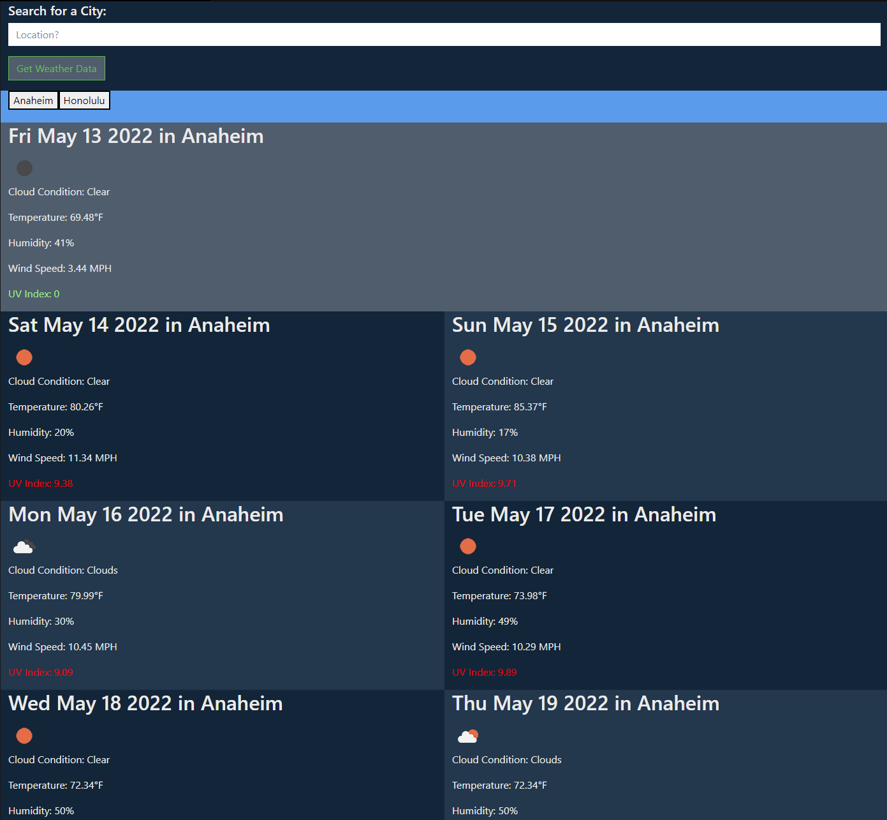

# Weather Tracker

This application allows the user to view the current and future weather forecast of their searched cities. Upon searching a city, the following weather data will display on the screen: 

```
1. Cloud condition + image representation
2. Temperature
3. Humidity
4. Wind Speed
5. UV Index value + color representation (green = low, orange = moderate-moderately high, red = very high)
```

Each researched city is automatically saved in the local storage and can easily be reaccessed upon click.

# Weather Tracker Demo



The weather tracker can be accessed here:

https://axe714.github.io/Weather-Tracker/